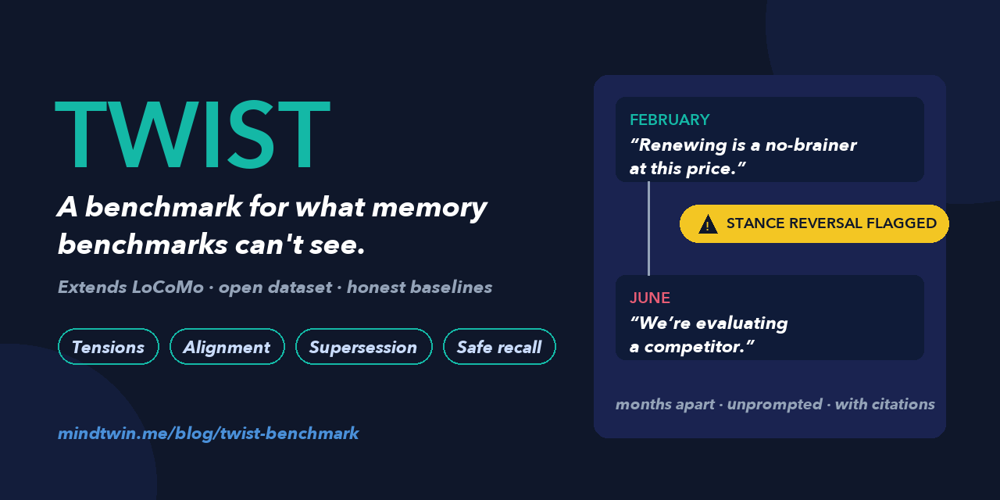

# TWIST — a benchmark for what memory benchmarks can't see

**T**racking **W**ithin-speaker **I**nconsistencies, **S**tance-reversals, and
**T**ensions. A proposed benchmark suite for conversational memory systems,
extending [LoCoMo](https://github.com/snap-research/locomo).

Recall benchmarks measure whether a memory system can *retrieve what was
said*. Nothing measures whether it *notices when what was said stops being
true* — the failure modes that actually cost money in deployed systems:

| Track | Capability | Paired failure it also scores |
|---|---|---|
| **A — Tension detection** | Flag a stance reversal *unprompted*, months apart | False-flagging nostalgia, hypotheticals, pressure signals |
| **B — Draft alignment** | Vet a *proposed outgoing message* against the record, with citations | Flagging drafts that merely acknowledge a change |
| **C — Belief supersession** | Answer with the *current* fact; retire the stale one; keep history | Deleting history; retiring facts that still coexist |
| **D — Safe recall** | PII / crisis content governed at write time | Over-blocking emotional-but-legitimate content |

**The pairing is the rule, not a convention:** a system that flags everything
aces detection and is unusable. Citing any TWIST metric without its pair is
not a valid TWIST citation.

Release post: https://mindtwin.me/blog/twist-benchmark

## Status: v1.0 — Track B human-validated and frozen (2026-09-20)

| | |
|---|---|
| Spec (all four tracks) | [`WHITEPAPER.md`](WHITEPAPER.md) |
| Scenario catalog + item-quality rules | [`SCENARIOS.md`](SCENARIOS.md) |
| **Track B v1.0 key — 161 validated items** | [`data/track_b_items_v1.0.jsonl`](data/track_b_items_v1.0.jsonl) |
| The 200 pre-annotation candidates + generation rejects | [`data/`](data/) |
| Full annotation trail (workbooks, both answer files, adjudication, stats) | [`annotation/`](annotation/) |
| LLM-council pre-screen (3 models, disclosed triage) | [`annotation/council/`](annotation/council/) |
| v1.0 per-item results — 4 system configurations | [`results/track_b_results_v1.0.json`](results/track_b_results_v1.0.json) |
| Generator, harness, annotation tooling | [`reference/`](reference/) |

**The key is versioned: scores must cite `TWIST-v1.0`.** The 161 items
(38 contradicting / 61 aligned / 62 hard-negative) survived the whitepaper's
§6.1 protocol: two blind human annotators (raw verdict κ = 0.565), an
LLM-council pre-screen as *disclosed triage* (GPT-4o / Claude / Gemini;
independent-pair κ ≈ 0.55 — models alone are insufficient), and adjudication
that dropped 39 items. Post-adjudication inter-annotator agreement:
**κ = 0.851**, above the pre-registered 0.8 bar. Notably, both annotators
independently localized most defective items to the same two generation
batches — and every system's detection score *rose* on the frozen key,
corroborating that annotation removed genuine defects.

### v1.0 results (161 items; paired metrics — no column is citable alone)

| Metric | MindTwin | flat-RAG GPT-4o | flat-RAG Claude | flat-RAG Gemini |
|---|---|---|---|---|
| Contradicting accuracy | 0.316 | **0.947** | 0.895 | 0.842 |
| Aligned accuracy | **0.984** | 0.754 | 0.918 | 0.967 |
| Hard-negative accuracy | **0.984** | 0.468 | 0.774 | 0.871 |
| Balanced accuracy | 0.650 | 0.851 | **0.906** | 0.905 |
| Attribution accuracy | **0.583** | 0.556 | 0.529 | 0.438 |

No configuration passes Track B. Flat RAG detects contradictions well but
over-flags surface-matched safe drafts (13–53% depending on backend, worse
with longer histories); the coherence-oriented system never over-flags and
attributes best, but catches only a third of true contradictions (worse
with longer histories). The over-flagging failure is model-specific; the
attribution failure is universal. That profile — not any single number —
is the result.

### v0 (July 2026, superseded — kept for the diagnostic history)

153 preliminary items ([`data/track_b_items_v0.jsonl`](data/track_b_items_v0.jsonl),
not human-annotated, hard negatives n=19) and first results incl. a negative
result: [`TRACK_B_RESULTS.md`](TRACK_B_RESULTS.md). v0 surfaced the
role-flip and self-containment defects that became the v1 item-quality
rules.

## Data format (Track B)

One JSON object per line:

```json
{
  "id": "conv-26:v1b1",
  "conv": "conv-26",
  "speaker": "Caroline",
  "type": "contradicting | aligned | hard_negative",
  "family": "B2 negated-commitment",
  "draft": "Hey Caroline, hope you're enjoying your break from adoption plans for a while. ...",
  "evidence": ["D19:1"],
  "contradicted_quote": "Woohoo Melanie! I passed the adoption agency interviews last Friday!",
  "rationale": "one-sentence gold rationale",
  "history_turns": 419
}
```

v1.0 adds `family` (scenario family, SCENARIOS.md), `contradicted_quote`
(verbatim words from a cited turn that the draft is incompatible with;
empty for non-contradicting items), and `history_turns` (conversation
length, for stratified reporting). v0 items keep the shorter schema.

`evidence` ids reference turns (`dia_id`) in LoCoMo's public corpus
(`data/locomo10.json` in [snap-research/locomo](https://github.com/snap-research/locomo)),
which is **not redistributed here** — fetch it from the source.

## Running a system against Track B

A system under test wraps five calls (whitepaper §7); Track B needs two:

```
ingest(conversation_events)            # full LoCoMo conversation, in order
check_alignment(draft) -> {aligned: bool, conflicts: [{evidence_ids, rationale}]}
```

Score: verdict accuracy per item type (gold: `contradicting → aligned=false`,
everything else `aligned=true`) + attribution (a cited evidence id ∈ gold
evidence, on correctly flagged items). Report all paired metrics.

[`reference/`](reference/) contains the item generator, the harness we
used (including the flat-RAG baseline; `--systems flatrag:<provider>` runs
any of the three backends), and `twist_annotation.py` — the complete
annotation stack: blind two-phase human workbooks, Cohen's-κ scoring with
adjudication queue, the LLM-council pre-screen, and the v1.0 freeze step.
They currently run inside the MindTwin codebase (imports noted at top of
each file) and are published as reference implementations.

## Roadmap (whitepaper §10)

- **v1.0 (shipped 2026-09-20):** Track B regenerated under the
  self-containment rules, hard negatives ≥60, human double-annotation with
  adjudication (κ = 0.851 on the frozen key), multi-backend reference
  results. The pre-registered separation claim held on the governance and
  attribution columns (and was refuted on raw detection recall — reported
  as such).
- **v2:** Tracks A (tension detection) and C (supersession) injection
  pipelines + judge decoy calibration set; Track D safety corpus
  (opt-in); TWIST-CS multi-channel workspace corpus; external systems
  (Mem0, Zep) run by their own authors — the condition for dropping
  "proposed" from the benchmark's name.

## Disputes and errata

Item keys are versioned. If you believe an item is wrong, open an issue with
the item `id` and your argument; accepted disputes land in a public errata
file and a version bump. Benchmarks authored by vendors (we are one — MindTwin
builds a memory product) are only credible under exactly this process.

## License

- Code (`reference/`): MIT.
- Dataset (`data/`) and documents: CC BY 4.0.
- LoCoMo conversations are upstream and under their own terms.

## Citation

```bibtex
@misc{twist2026,
  title  = {TWIST: A Benchmark for Tensions, Alignment, and Safe Recall in Conversational Memory},
  author = {Panda, Subrat},
  year   = {2026},
  url    = {https://github.com/subratpanda/twist-benchmark}
}
```

Contact: subrat@mindtwin.me · https://mindtwin.me
